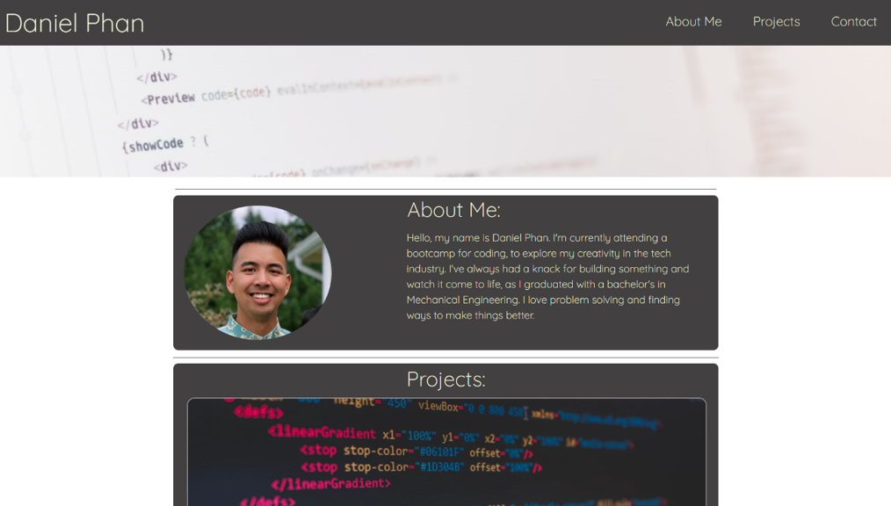
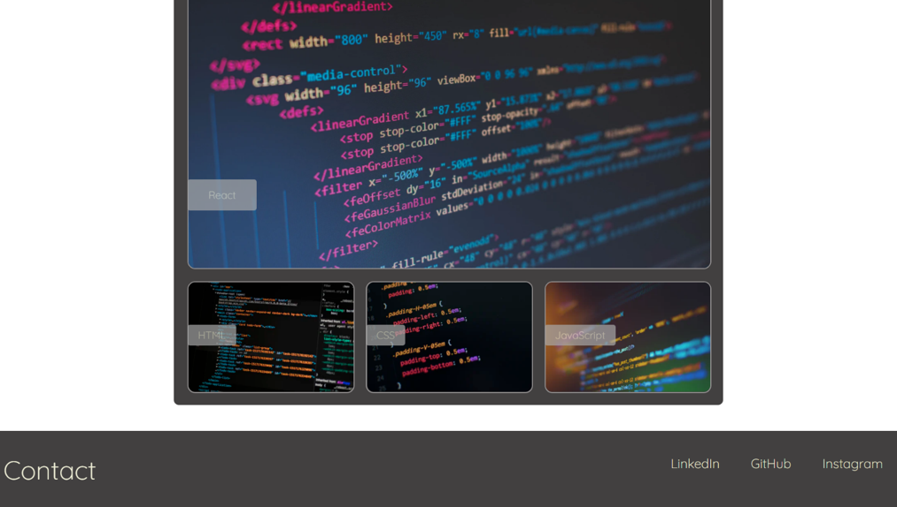

# Portfolio

## Overview: 

What's the first thing that employers look for when you apply for a job? You guessed it! It's a portfolio. So what's in a portfolio you ask? A portfolio should showcase all of your work. What this does, is it gives employers an in-depth look at your skills, to determine whether you're a good fit for the role. Your portfolio should tell a story about **YOU**. Think about it as creating a brand for yourself. 

## Objective: 

For this activity, we're building a responsive portfolio that showcases our work by utilizing HTML and CSS. A responsive webpage means that you can view the content on multiple devices, whether it be a desktop, tablet, or mobile phone. We want to make sure that we include an about me, projects, and contact section. Although, you may not have much work to showcase right now, you can use placeholders until you do. **Remember** this should be unique to you. Create your portfolio in a way that represents who you are and what you're capable of doing.

Feel free to take a look at my portfolio here: [Portfolio](https://dannyphan6.github.io/Portfolio/)

